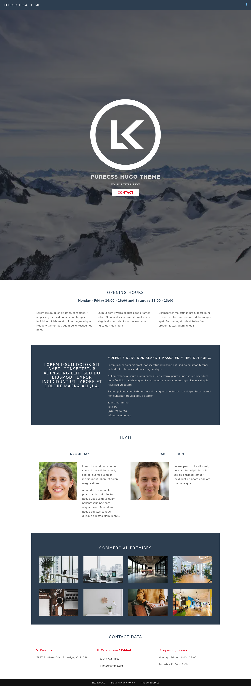

# purecss Hugo theme

Hugo theme based on [purecss](https://purecss.io/).
The theme is based on the [purecss landing page example](https://purecss.io/layouts/marketing/).

[Live Demo](/#)

## Preview



## Features

- Responsive
- Mobile first
- Multi-column layout
- Css only
- Make use of modern image formats: webp
- Optimized for speed and performance
- Built-in 404 page
- Automatically sitemap.xml generation
- Well formatted code.

## Get the theme

Minimum Hugo Version: 0.83

Run from the root of your Hugo site:

```
$ git clone https://github.com/lukki15/purecss-hugo-theme.git themes/purecss
```

Alternatively, you can include this repository as a [git submodule](https://git-scm.com/docs/gitsubmodules). This makes it easier to update this theme if you have your Hugo site in git as well:

```
$ git submodule init
$ git submodule add https://github.com/lukki15/purecss-hugo-theme.git themes/purecss
```

## Issues

If you have a question, please [open an issue](https://github.com/lukki15/purecss-hugo-theme/issues) for help and to help those who come after you. The more information you can provide, the better!

## Contributing

Contributions, issues, and feature requests are welcome! For major changes, please open an issue first to discuss what you would like to change.

## License

The code is licensed under [MIT](https://github.com/lukki15/purecss-hugo-theme/blob/main/LICENSE)

The LK logo image is copyrighted and used by permission for this project only.  
All other images are licensed under public domain, more information [here](./exampleSite/content/images.md)